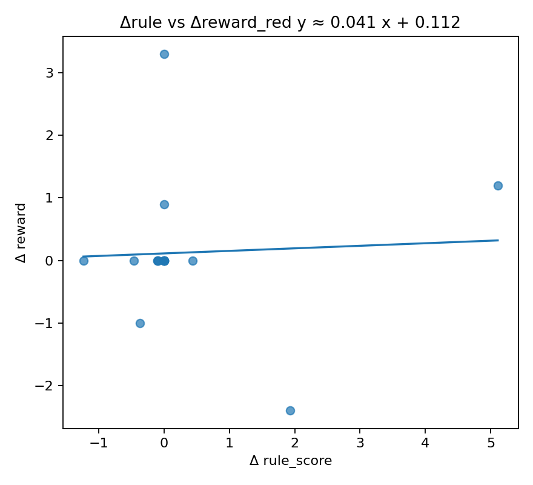
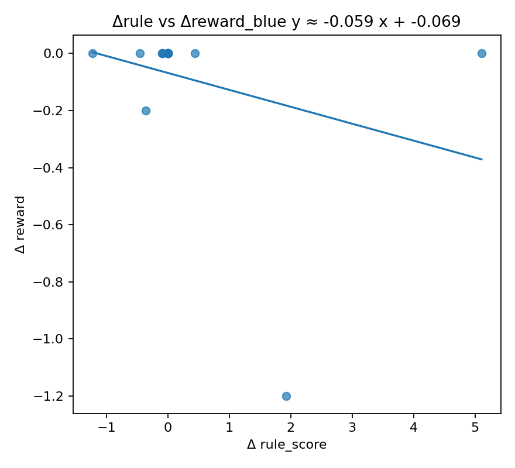

# Faithfulness Summary

- N variants (excl. baseline): **16**
- Pearson (Δrule ↔ Δreward_red): r=0.0504, p=0.8529
- Pearson (Δrule ↔ Δreward_blue): r=-0.2794, p=0.2946
- Spearman (Δrule ↔ Δreward_red): ρ=0.3397, p=0.198
- Spearman (Δrule ↔ Δreward_blue): ρ=-0.0716, p=0.7922

